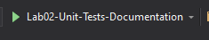
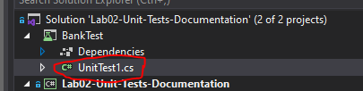
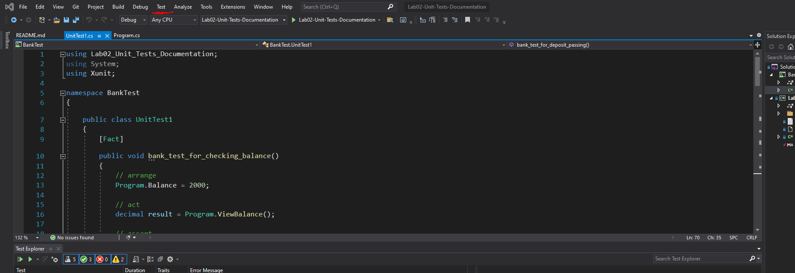
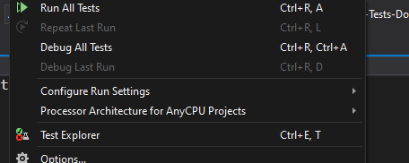
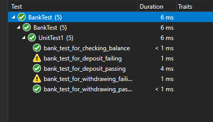

# Lab02-Unit-Tests-Documentation

This lab is a demonstration of a working ATM. As a User you are given a bank balance and can check its balance, withdaw money, or deposit money. 

To run the lab:
Click the Green Arrow Labeled: "Lab2-Unit_Tests_Documentation"  

To Run the lab tests: 
Click on the UnitTest1.cs file from your file explore. It is located in the BankTest Folder. 
    

From there click the Test Button at the top of the screen.    
  

From there click the Run all Tests Button  

Wait for the tests to complete and you should see all green.   
Red means it failed.   
Yellow means the test was skipped.   

